# Building a Data Center from the Ground Up: Cloud4Y's Journey to Infrastructure Independence

Building your own data center is a massive undertaking—one that promises complete control over infrastructure, enhanced reliability, and new business opportunities. But it also brings significant challenges: massive capital investment, specialized expertise requirements, and the risk of diverting focus from core services. Cloud4Y, a cloud provider with 15 years of experience, has reached the point where owning their infrastructure makes strategic sense. Here's how they're transforming abandoned land in the Moscow region into state-of-the-art data centers—and why containerized solutions are helping them launch services before the main buildings are even complete.

---

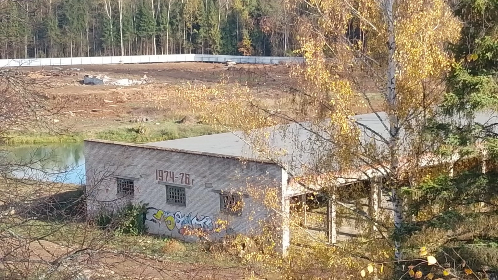

## Why Cloud Providers Build Their Own Data Centers

Owning a data center gives cloud providers complete control over every layer of infrastructure—from power and cooling to physical security and network connectivity. This eliminates dependency on external contractors, reduces downtime risks, and allows providers to develop custom security and service standards tailored to specific client needs.

The business advantages are compelling: you become the single point of accountability for service quality, which builds client trust. You can offer additional services like rack rentals, colocation, and hybrid solutions combining cloud services with physical infrastructure. You gain pricing flexibility and improve margins by eliminating the middleman.

But there's a reason most cloud providers rent space in established facilities: **specialization matters**. Managing a data center is a separate business requiring specific expertise, qualified personnel, and constant attention to complex engineering systems. The upfront costs are staggering—not just construction, but implementing redundant power systems, industrial cooling, fire suppression, monitoring, access control, and obtaining necessary certifications.

👉 [Discover how Gthost delivers enterprise-grade infrastructure without the complexity of building your own data center](https://cp.gthost.com/en/join/72c7e6b2fc118929f9ede2978f008806)

Even after launch, data centers demand continuous investment in equipment upgrades, maintenance, and monitoring to maintain reliability and meet evolving standards. Cloud4Y determined they had reached the scale and maturity where these investments made strategic sense.

## DC4Y.1-Marfino: Transforming Abandoned Land into Technology Infrastructure

Cloud4Y's first proprietary facility (working name DC4Y.1-Marfino, future official name TerraBit) sits on 8.2 hectares in Marfino village, Moscow region—just 22 km from the Moscow Ring Road with excellent transport access.

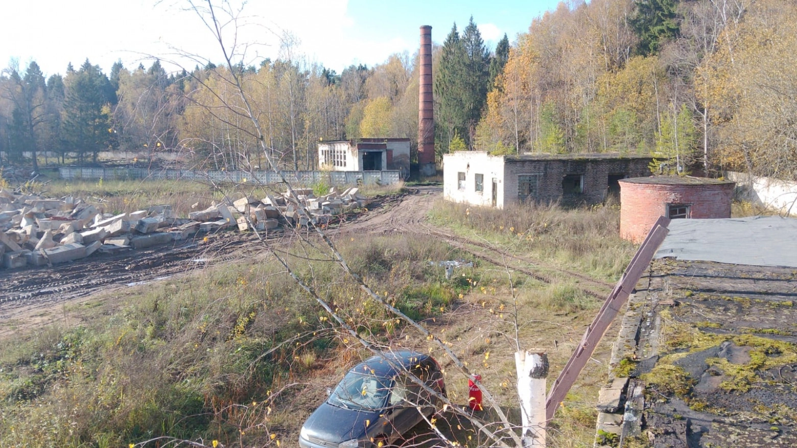

The site had been exploited for decades before abandonment, leaving behind derelict structures and debris. Site preparation has been intensive: clearing vegetation, excavating old foundations (many buildings had extensive basements), and removing accumulated waste. The good news? Convenient access roads and space for staging areas where client equipment can be temporarily stored.

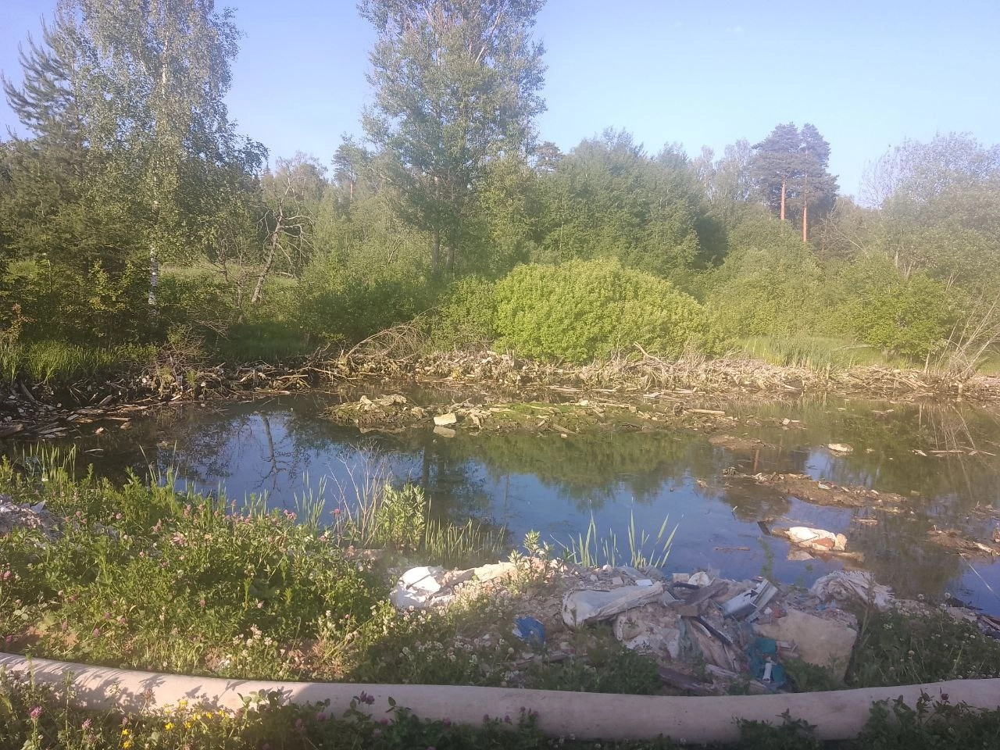

An unexpected discovery: a small natural pond fed by an underground spring. Rather than fill it in, Cloud4Y is incorporating it into the redesigned site plan—the pond will be restored, landscaped, and even stocked with fish.

## Phased Development: From 1,200 to 4,800 Rack Spaces

The project follows a four-phase rollout:

**Phase 1:** 1,200 rack spaces, up to 10 MW capacity, 5,500 sq m  
**Phase 2:** 2,400 rack spaces, up to 20 MW capacity, 11,000 sq m  
**Phase 3:** 3,600 rack spaces, up to 30 MW capacity, 16,500 sq m  
**Phase 4:** 4,800 rack spaces, up to 40 MW capacity, 22,000 sq m

All systems feature redundancy from N+1 to 2N levels, ensuring reliability and fault tolerance. The facility is designed to meet international standards with TIER III and TIER IV certification targets from the Uptime Institute.

### Power and Cooling Infrastructure

The facility connects to municipal power grids with backup UPS systems and diesel generators enabling autonomous operation. On-site fuel storage ensures extended independent operation during outages. Cooling systems utilize "green" technologies to minimize environmental impact while maximizing energy efficiency.

### Fire Protection and Security

Modern fire protection includes non-combustible materials, isolated fire zones, early warning systems, fire alarms, and gas-based suppression systems that protect equipment without water damage.

Security features 24/7 staffing with multiple perimeter control layers. The design includes anti-drone protection—reinforced walls and anti-drone nets—especially critical given current geopolitical tensions.

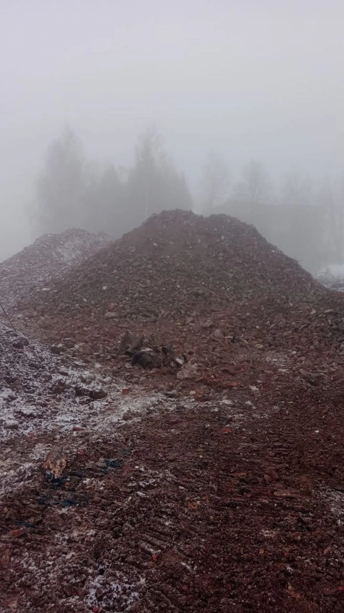

## Sustainable Construction: Recycling Demolition Materials

After expert evaluation, Cloud4Y decided to demolish nearly all existing structures. Some buildings were in poor condition; others simply couldn't be adapted to modern data center requirements with their stringent standards for power, cooling, and security.

Rather than trucking demolition waste to landfills, Cloud4Y is processing it on-site. A rock crusher pulverizes concrete, brick, and large stones into gravel, which is then used for site grading.

This approach delivers multiple benefits:

- **Resource savings:** Reusing materials reduces disposal costs and purchases of new materials
- **Creating stable foundations:** Crushed material compacts the soil, improves drainage, and creates solid foundations for future structures
- **Environmental benefits:** Reduces landfill waste and environmental burden
- **Logistics savings:** Processing materials on-site eliminates transportation costs and accelerates construction timelines

The crushed material creates a porous structure promoting drainage while preventing soil settlement issues. It ensures stability and even load distribution across the ground—critical requirements for data center facilities.

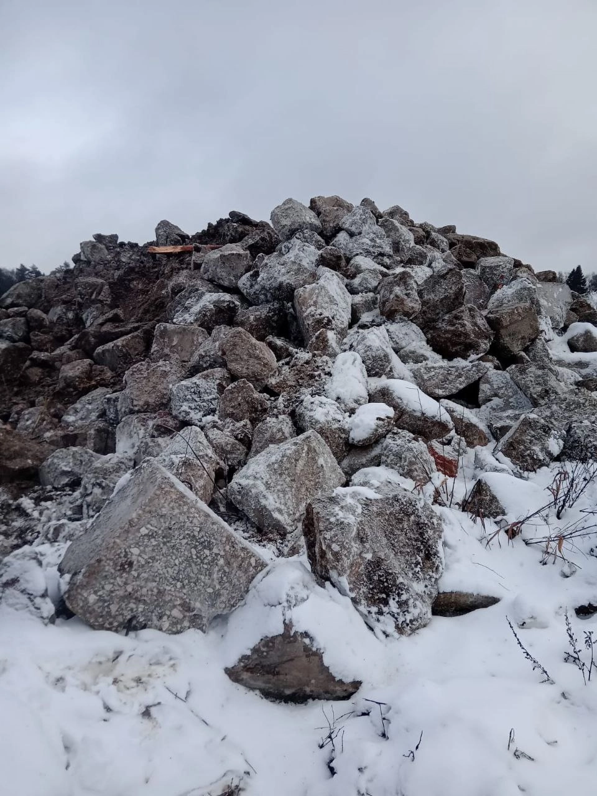

## Containerized Data Centers: Launching Services Before Buildings Are Complete

While permanent structures are under construction, Cloud4Y is deploying **containerized data centers (CDDC)** to launch services quickly. These aren't temporary solutions—they're sophisticated, fully-equipped facilities that can operate independently or complement traditional buildings.

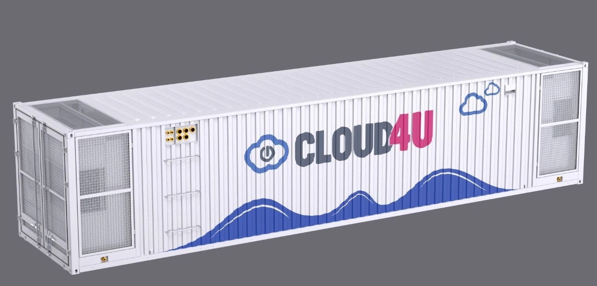

### What Is a Containerized Data Center?

A containerized data center is an autonomous module housed in a specialized metal container equipped with everything needed for data storage, processing, and transmission. Each CDDC contains server racks, cooling systems, uninterruptible power supplies (UPS), security systems, and monitoring equipment. CDDCs can be easily transported on standard roads and deployed virtually anywhere with power and connectivity.

### Common Use Cases for Containerized Data Centers

- **Remote regions:** Deploying computing capacity where traditional construction is impossible or uneconomical
- **Temporary projects:** Supporting large events (exhibitions, sports competitions)
- **Backup capacity:** Ensuring uninterrupted operation during peak loads
- **Extreme conditions:** Supporting critical infrastructure in harsh climates
- **Industrial facilities:** Providing computing power at remote production sites
- **Small-scale deployments:** When growth projections don't justify permanent construction
- **Rapid deployment:** When there's no time for design, permitting, and traditional construction

In Russia, CDDCs are gaining popularity in oil and gas (Siberian and Far North fields), telecommunications (low-density regions), and anywhere rapid infrastructure deployment is needed.

### Cloud4Y's Containerized Solution: Technical Specifications

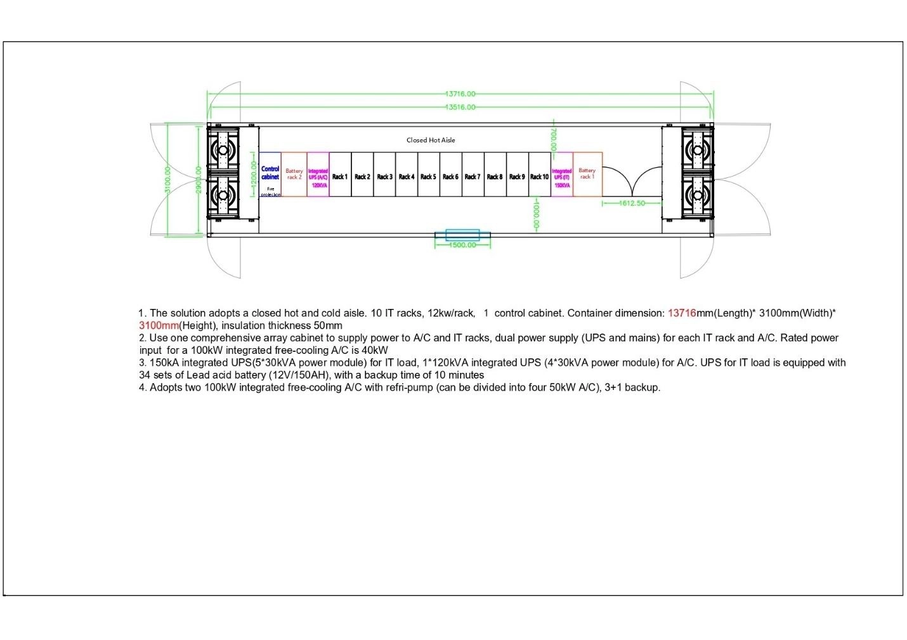

After extensive market research, Cloud4Y found few suppliers willing to customize solutions significantly. They partnered with a manufacturer capable of building containers to exact specifications and implementing future modifications.

**Key specifications:**

- Closed hot and cold aisle containment
- 10 server racks, 12 kW per rack, 1 management cabinet
- UPS for server racks and cooling systems
- Efficient cooling in N+1 configuration
- Automatic switchover to diesel generator backup power
- Climate parameter monitoring, security, and fire suppression systems

**Special design considerations:**

**Efficient and reliable cooling:** Indirect free cooling units with supplemental freon cooling circuits. Four cooling systems with N+1 redundancy (located at container ends). In moderate weather, air circulates in a closed loop (no outside air intake) and cools through heat exchangers—far more economical than traditional methods. Hot and cold aisles are organized in front and behind racks. Cold air is drawn into IT equipment; hot air is expelled to the cooling system.

**Insulation:** Containers designed for low regional temperatures.

**Convenience and energy efficiency:** 10 IT racks (47U high) plus 4 service racks (at edges). Factory-installed redundant Power Distribution Units (PDUs). Pre-routed cable trays for network cabling. Convenient access to all equipment.

**Security:** Service racks house monitoring systems (temperature, humidity, smoke detection, access). Access control systems included.

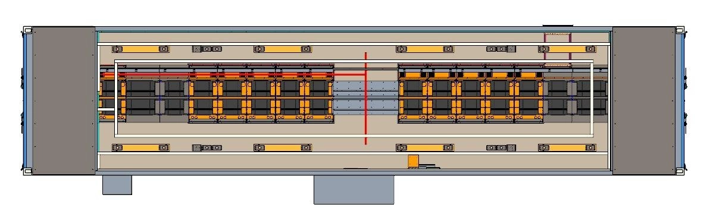

### Advantages of Containerized Data Centers

- **Rapid deployment:** Factory-ready systems launch quickly when external power and connectivity are available
- **Mobility:** Simple transportation and installation without complex preparation
- **Cost-efficiency:** Using standardized containers eliminates custom design and construction from scratch
- **Energy efficiency:** Precision cooling systems reduce power consumption and operating costs. Indirect free cooling provides necessary cooling with lower expenses
- **Application flexibility:** Operates in extreme temperatures from -35°C to +45°C
- **Autonomy:** Complete redundancy of engineering systems enables operation without external dependencies

### CDDC Specifications

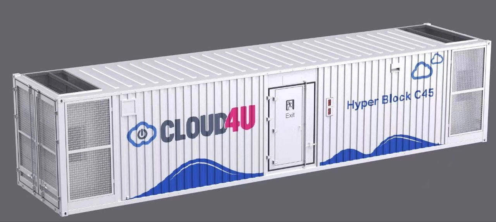

- TIER III compliance
- All-weather insulated container, antistatic flooring, grounding
- Diesel generator backup power
- Redundant communication lines
- 24/7 access, security service
- 10 racks (47U each), up to 12 kW per rack
- Uninterruptible power for IT rack equipment (modular UPS in N+1 configuration)
- Dedicated UPS for mechanical loads in N+1 configuration
- Sealed cold and hot aisles
- Control and security systems (access control, video surveillance, temperature/humidity/smoke sensors, gas fire suppression, etc.)

Each IT rack and air conditioner has redundant uninterruptible power lines from UPS with external connections to both utility power and diesel generators.

**Cooling system:**
- Four integrated free cooling air conditioners with 200 kW total capacity, equipped with refrigerant pumps
- Indirect free cooling
- 3+1 redundancy (three operating, one standby)

**Scalability:** Scale within existing container racks or distribute IT equipment across multiple separate containers, increasing information system fault tolerance.

## Construction Progress: Summer 2025 Launch Target

**First containers arriving in Marfino by summer 2025.** They'll be fully equipped and operational, allowing Cloud4Y to launch their proprietary data center before completing the permanent building. The Marfino site will offer infrastructure in two configurations: main building or containers, with the option to combine both.

Cloud4Y is pursuing two business directions:
1. Leasing capacity in their CDDCs or renting entire containers
2. Supplying customized containers to clients

### Marfino Site: Current Status

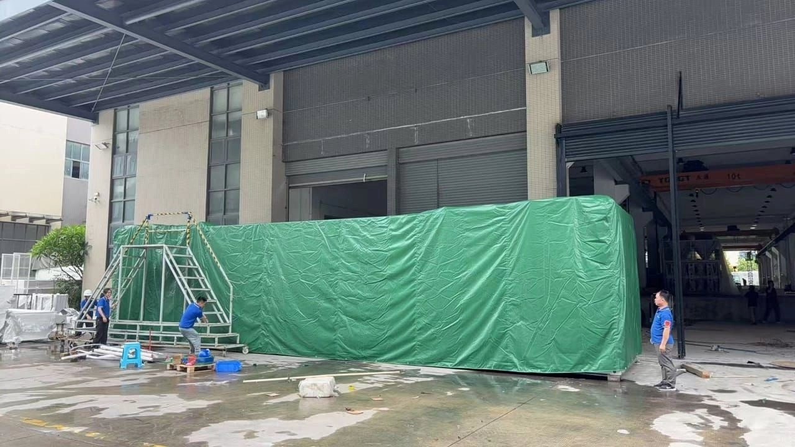

The first containerized data center has arrived—transported by sea to Riga, then overland to the site. The foundation was prepared in advance, with expanded maneuvering space for heavy equipment.

A gas-powered generator station is installed on its own foundation (supplier requirement for level, stable positioning). Key tasks now:

- **150 kW power connection** for the first CDDC (contract signed, transformer replacement and cable routing in progress)
- **1 Gbps fiber optic connection** for video surveillance (ready in July)
- **Temporary shelter** for gas generator servicing the first CDDC
- **Parking coordination** for specialized vehicles and underground utilities

The 150 kW capacity isn't arbitrary—it's optimized for the current configuration with peak loads and auxiliary equipment (cooling, alarms, lighting). Each subsequent container will require similar capacity, so energy coordination is ongoing.

### Backup Power and Infrastructure

Backup power includes UPS systems (10-30 minutes autonomous operation) and diesel generators for extended outages.

Pressurized sewage system under construction—pumps will handle wastewater across the extended route, serving all CDDC units on the Marfino territory. Simultaneously: metal structure installation for KPP canopy, site landscaping, and water supply project development.

### Mytishchi Site: Preparing for Large-Scale Launch

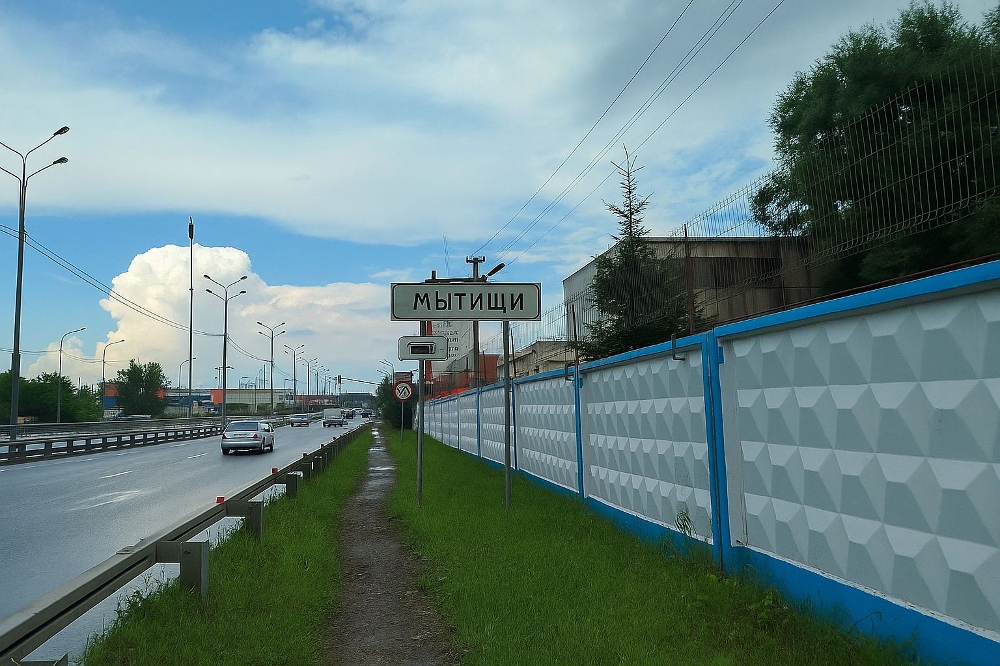

Mytishchi is in earlier stages: land lease formalized, building assessment complete (administrative building in good condition; data center structure requires major renovation). Designers are studying existing utilities and developing site access plans.

Primary focus: **securing 40 MW power supply**—negotiations ongoing for proper connection and logistics. This is a lengthy process requiring comprehensive approach and future expansion planning.

### Network Infrastructure Expansion

Responding to IPv4 address scarcity, Cloud4Y successfully acquired 4,500 new IP addresses. This purchase enables flexibility for growing client needs—dedicated IPs for hosting servers to complex integration projects. New addresses are already added to the provider network and available for order.

## Client Services and Business Opportunities

Traditional cloud IT services (cloud servers and services), client IT equipment hosting in reliable engineering infrastructure, communication services, IT equipment rental, and IT infrastructure support will all be available from Cloud4Y's proprietary facilities.

**50+ IaaS & SaaS solutions including:**

- Fault-tolerant cloud servers operating across multiple data centers
- "Cloud Federal Law-152" solution certified for security classes UZ-1, K-1
- Disaster recovery and backup solutions
- Cloud storage (S3 object storage, NextCloud file sharing)
- SaaS solutions (remote desktops, corporate cloud email, cloud 1C, video surveillance, etc.)
- Security solutions (VPN, WAF, NGFW, DDoS protection, DLP solutions, AntiSpam, AntiVirus, etc.)

Services provided via subscription model with pay-as-you-go billing.

### Colocation Services

Standard rack space in data center machine rooms with these conditions:

- Standard 19" server rack space, 48U height, 600×1070mm dimensions
- Guaranteed electrical capacity 5-20 kW
- Two independent electrical inputs (rack lines, in-room cabinets, UPS, diesel generators, transformer substations)
- Uninterruptible power in machine room, climate maintenance at 18-27°C, 30-60% humidity
- Unauthorized access prevention and physical security
- Option for 2/4 PDU blocks
- Automatic transfer switch option
- Dedicated service manager
- 24/7 baseline technical support
- 24/7 unlimited access
- Temporary workspace for equipment preparation and configuration
- Temporary console equipment provision
- Round-the-clock equipment delivery/removal

**Additional services:** Custom rack rental, access control and video surveillance installation, remote monitoring and management, IT equipment rental and installation, custom lock installation, cold aisle containment, protective enclosures around client racks, data room or equipment storage rental.

**Service offerings:** 24/7 client support, SmartHands services for basic operations, equipment rack installation, server equipment assembly and testing, monitoring, backup, inventory, and equipment maintenance.

---

## Moving Toward Complete Infrastructure Control

Cloud4Y's journey demonstrates both the opportunities and challenges of owning data center infrastructure. The phased approach—launching with containerized solutions while constructing permanent facilities—allows them to serve clients immediately while building toward long-term strategic goals.

Every cleared plot, installed foundation, and connected power line represents progress toward Cloud4Y's central objective: providing clients with maximally reliable, secure access to cloud services. Proprietary data centers create the foundation for stability, growth, and new capabilities at competitive prices. With 15 years of cloud service experience behind them, Cloud4Y has reached the maturity point where infrastructure ownership makes strategic and financial sense—transforming abandoned land into the backbone of their next phase of growth.
